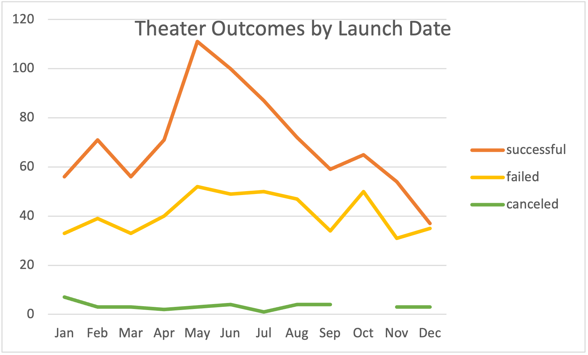
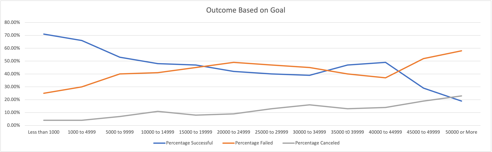

# Kickstarter Campaign Analysis
## Overview of Project
### Purpose
The purpose of this project was to break down the data provided to help Louise find which theater campaign was the most successful in the shortest amount of time. Using excel we were able to analyze which months produced the highest amount of successful theater campaigns, and which months would not be good to start campaigns on. We were also able to determine which campaign goals would have a higher percentage of being successful, this would help Louise keep her campaign goal in a reasonable amount range. 
## Analysis and Challanges
### Analysis of Outcomes Based on Launch Date

* Looking at this graph you are able to see that the most successful months for campaigns are in May, June and even July. You can also see that by the end of the year the successful campaigns dwindle especially in December.
### Analysis of Outcomes Based on Goals

### Challenges and Difficulties Encountered

